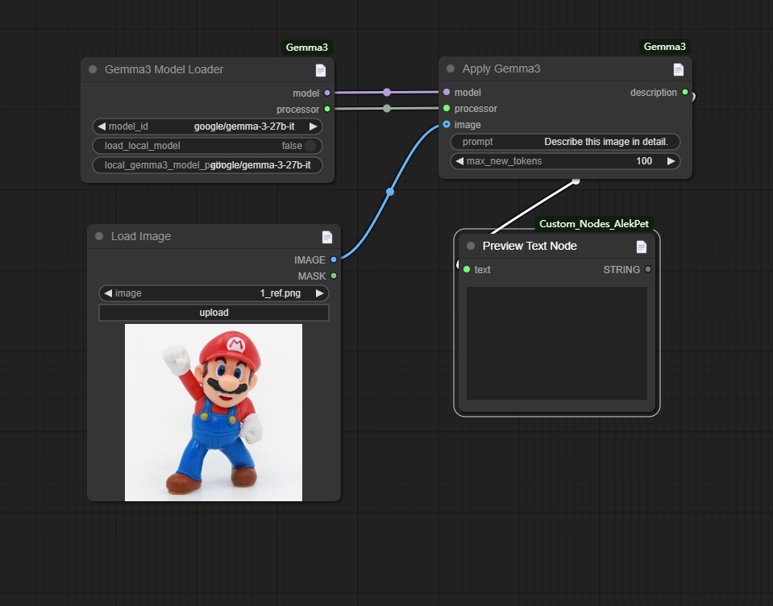

# ComfyUI nodes to use Gemma3

https://huggingface.co/google/gemma-3-27b-it

## Install

- 推荐使用管理器 ComfyUI Manager 安装（On the Way）

- 手动安装：
    1. `cd custom_nodes`
    2. `git clone https://github.com/leeguandong/ComfyUI_Gemma3.git`
    3. Install dependency packages pip install -r ComfyUI_Gemma3/requirements.txt
    4. 重启 ComfyUI

## Stars

